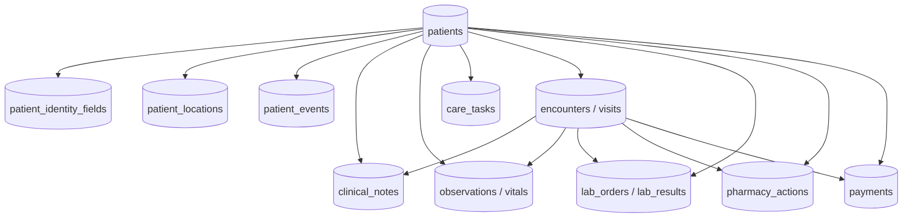
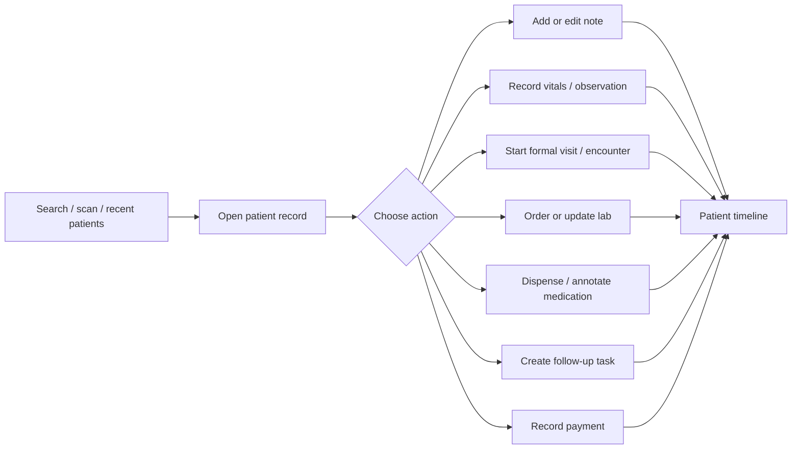

# Patient-Centered Architecture Plan

> Status: planning handoff. This is a long-term structural plan, not a quick fix list. The project is currently in testing phases, but the target application must be performant and operationally reliable at future scale: hundreds of thousands of patient interactions per week across Android and web.

## Executive summary

Karibu Health currently behaves like a queue system: software pushes a patient through registration, vitals, clinician note, review, pharmacy/lab/payment, and completion. That model is too rigid for community care and too fragile for offline-first sync. The target architecture should become patient-centered and staff-pull based.

New operating model:

```text
Staff member searches for or opens a patient record
→ chooses the work they need to do
→ adds a note, vital, lab update, pharmacy action, payment, task, or encounter
→ data attaches to the patient first
→ visit/encounter context is optional except where operationally required
```

The software should not force every patient through every station. A clinician, lab, pharmacy, records officer, or cashier should be able to "go get" the patient record and do the relevant work.

Core architectural principle:

```text
Patient is the durable clinical record.
Visit is one operational event in that record.
Notes, vitals, labs, medications, tasks, and payments are patient-linked records.
Many of those records may optionally attach to a visit.
```

## Current baseline (as of 2026-05-12)

Before executing this plan, recognize what's already in place. Some Phase 1–7 deliverables are partially or fully shipped.

**Already aligned with this plan:**

- `patient_vitals` table (migration 029) is already patient-first: `patient_id NOT NULL`, `visit_id` nullable, indexed `(patient_id, recorded_at DESC)`. **Phase 4 schema work is done — UI work remains** (longitudinal display, latest-known fallback, no required-vitals gating).
- AI is already modeled as a colleague, not a SOAP generator. Migration 033 added `ai_review_suggestions` (questions + Uganda corpus citations + clinician-response audit) and `ai_review_status` on visits. Inngest runs three independent handlers: `reviewClinicianNote`, `draftPatientReceipt`, `suggestHmisCode`. **Phase 7's "AI on top, not gating" is done at the data + workflow level** — UI surface remains.
- The `dictate` edge function is stateless: audio in, transcript out, no DB write, no consent gate. Matches the dictation-enabled posture cleanly.
- HC III roles + departments (migration 024) are in place: `clinical_officer`, `midwife`, `nursing_assistant`, `records_officer` plus `visits.department` with `opd | anc | maternity | family_planning | immunization`. **Phase 5 worklists can build on this foundation.**
- `patient_id` BIGINT (migration 019) auto-generates clinic-scoped numeric IDs. The patient identifier model is already partially decoupled from phone number.

**Structural problems confirmed in code:**

- `provider_notes.visit_id` and `patient_notes.visit_id` are both `NOT NULL`. There is no path today for a patient-only note. Phase 2's schema migration is necessary.
- Duplicate detection on Android (`PatientDao.findLikelyDuplicate`) and web (`createPatientWithVisit`) both require exact name + exact DOB match. No DOB → no duplicate detection. Phase 1 is necessary and high-leverage.
- The Android note-sync bug is a specific, identifiable defect: `SyncEngine.kt:99-128`. When `syncCreatePatient` succeeds with HTTP 200, it upserts the server patient to Room but does not walk dependents to swap their local UUID for the server UUID. The swap only fires inside the HTTP 409 conflict branch (lines 110-128). Queued visit RPCs ship with the local patient UUID, fail server FK validation, get marked `failed` after 5 retries, and every queued note that depends on that visit's sync entry stalls forever at the single-hop `depends_on != "completed"` gate (line 51).
- Save on both Android (`DictationViewModel.submit()`) and web (`saveClinicianNote()`) is overloaded: provider_notes write + patient_notes write + visit clinical column update + `documentation_complete=true` + `ai_review_status='not_started'` + status `pending → sent` — all in one button. Phase 2's autosave-vs-finalize split needs to decouple these.
- No autosave anywhere. Typing only mutates UI state (`savedLocally = false`); nothing persists until Save is tapped. Phase 2's draft persistence is greenfield on both platforms.

**Cleanup-only items:**

- `visits.ai_structure_status` (migration 032) is dead — superseded by `ai_review_status` (033). The legacy column and its index can be dropped in a future migration.
- The `pending → review → sent → completed → error` state machine on visits is largely bypassed today: `rpc_mark_documentation_complete` jumps `pending → sent` directly, skipping `review`. Phase 2 should formalize this rather than leaving the documented machine and the actual machine out of sync.

**Phase scope correction:** **Phase 6 is smaller than originally written.** The Android sync engine has a specific identifiable defect, not a structural failure. The plan's recommendation to redesign sync around entity-first ordering with idempotency keys is still correct, but the immediate fix is one missing dependent-payload walk on `syncCreatePatient`'s success branch (and similar transitive failure propagation for downstream operations). The patient-first records work in Phase 2 simplifies the dependency graph naturally — by the time the entity-first redesign lands, notes will already not require visits, which collapses the most fragile dependency chain.

## Why this shift is necessary

### 1. The queue-push model does not match field reality

Current flow assumes a patient moves linearly:

```text
Create patient
→ create visit
→ vitals
→ note
→ review / payment / print
```

Field reality is more variable:

- A clinician may call a patient later and add a follow-up note.
- A lab may update a result after the clinical encounter.
- A pharmacy worker may dispense later, partially dispense, or annotate stock issues.
- A clinician may update the patient record without creating a new billable visit.
- A patient may skip vitals because equipment is unavailable.
- A previous height or weight may be clinically useful when today's measurement is missing.

The app should support those workflows directly instead of forcing the user to create or complete a visit as a workaround.

### 2. The current sync dependency chain is too fragile

The Android app currently creates a chain like:

```text
create_patient
→ create_visit
→ insert_patient_vitals
→ upsert_provider_note
→ upsert_patient_note_summary
→ upsert_visit_clinical_summary
→ mark_documentation_complete
```

That chain is reasonable for a formal visit, but it is too much dependency for basic note persistence. If a note is patient-linked first, it can sync as soon as the patient identity is resolved. It should only depend on a visit if the note is explicitly part of a visit.

### 3. Date of birth assumptions do not fit Uganda context

The current patient creation and duplicate logic relies heavily on exact date of birth. In the target setting, many patients do not know their full date of birth. They may know:

- name
- village, parish, town, or neighborhood
- approximate age
- birth year only
- family or guardian name
- phone number, sometimes

The system must not require a fabricated exact date of birth for lookup, reporting, or care.

### 4. Save buttons are the wrong mental model for clinical note drafts

Clinicians should not lose work because they forgot to press Save. Clinical note creation should behave more like Apple Notes:

```text
Typing or dictation continuously autosaves a draft.
The draft syncs opportunistically.
"Sign", "finish documentation", or "mark ready" is a separate explicit action.
```

Save should not be overloaded to mean "persist text", "finalize note", "advance visit", "trigger AI", and "enable payment" all at once.

## Target domain model

The target model should be additive first. Do not rip out `visits` while the current apps, reports, payment, pharmacy, lab, and review flows still depend on it.



### Entity responsibilities

| Entity | Required link | Optional link | Purpose |
|---|---:|---:|---|
| `patients` | clinic | none | Durable person record |
| `clinical_notes` | patient | encounter/visit, task, lab result | Drafts, signed notes, phone notes, follow-up notes |
| `observations` / `patient_vitals` | patient | encounter/visit | Longitudinal measurements |
| `encounters` / `visits` | patient | department, queue, billing context | Formal clinic interaction |
| `care_tasks` | patient | encounter/visit, assignee | Follow-up worklists |
| `lab_results` | patient | order, encounter/visit | Diagnostic record |
| `pharmacy_actions` | patient | prescription/order, encounter/visit | Dispensing record |
| `payments` | patient | encounter/visit | Cashier and receipt workflow |

## Patient identity model

Exact DOB should become optional. The app should support identity confidence instead of pretending all patients have Western-style demographics.

Proposed patient identity fields:

```text
first_name
last_name
other_names
sex
phone_number
village
parish
subcounty
district
guardian_name
local_patient_number
national_id, nullable
date_of_birth, nullable
birth_year, nullable
approximate_age, nullable
age_recorded_at, nullable
dob_precision: exact | year_only | age_estimate | unknown
```

Rules:

- Do not fabricate `date_of_birth`.
- If patient knows exact DOB, store it with `dob_precision='exact'`.
- If patient knows birth year only, store `birth_year` and `dob_precision='year_only'`.
- If patient only knows age, store `approximate_age`, `age_recorded_at`, and `dob_precision='age_estimate'`.
- If unknown, store `dob_precision='unknown'`.
- Reporting code should derive approximate age bands from the best available source.

Patient lookup should support:

```text
name prefix / fuzzy name
phone
local patient number
national ID if present
village / parish / town
guardian or family name
approximate age / age band
sex
```

Performance requirements for lookup:

- Local Android lookup must be fast from Room cache.
- Server search must support indexed fuzzy name and location lookup.
- Web duplicate review must be available for staff to merge or mark as distinct.
- Search result ranking should show why a match appears, for example: "same village", "similar name", "same phone", "age around 27".

## Staff-pull workflow model

Replace "push patient through the organization" with role-based worklists and patient search.



Worklists still exist, but they should be pull-based:

- Needs clinician
- Needs vitals
- Needs lab result
- Needs pharmacy action
- Needs payment
- Needs follow-up
- My draft notes
- Recently viewed patients
- Unsynced local work

Each worklist opens the same patient record, not a separate isolated flow.

## Notes model

Notes should move from visit-first to patient-first.

Target note behavior:

```text
patient_id required
visit_id optional
status: draft | signed | amended | voided
source/context: visit | phone_call | follow_up | lab_update | pharmacy_update | general
content autosaves locally
sync runs opportunistically
signing/finalization is explicit
```

Do not overload one button.

Separate operations:

| Operation | Meaning |
|---|---|
| Autosave draft | Preserve current note content locally and sync when possible |
| Sign note | Clinician attests note is ready as a clinical record |
| Finish visit documentation | Encounter is complete for queue/payment/reporting purposes |
| Request AI support | Optional background review, summary, coding, or patient receipt |

The Android and web note editors should share these semantics even if the UI differs.

## Vitals and observations model

Vitals should be longitudinal and optional.

Rules:

- Every vital field is nullable.
- `patient_id` is required.
- `visit_id` is optional.
- `recorded_at` and `recorded_by` are required.
- Latest known values should be shown in future contexts.
- UI must distinguish "not captured today" from "unknown".

Example display:

```text
Today:
Weight: 17.4 kg at 09:21
Temp: 38.2 C at 09:21
SpO2: not captured

Latest known:
Height: 104 cm, captured 2026-04-08
BP: 110/70, captured 2026-03-19
```

This supports community care without pretending missing measurements are errors.

## Sync architecture target

Sync should become entity-first and dependency-aware.

Each offline-created entity needs:

```text
local_id
remote_id, nullable until synced
entity_type
operation_type
payload_version
idempotency_key
dependency local_ids
dependency remote_ids once resolved
status
attempts
last_error
created_at
updated_at
```

Critical rule:

```text
A patient note should depend on patient identity.
It should not depend on a visit unless visit_id is actually attached.
```

For formal visits, dependency ordering remains:

```text
patient
→ encounter/visit
→ visit-linked observations, notes, labs, pharmacy actions, payments
```

For patient-only work, dependency ordering is simpler:

```text
patient
→ patient note / observation / task
```

Sync must be idempotent on the server side. Replaying the same operation should update or no-op, not duplicate clinical records.

## Performance and scale principles

The testing phase should not produce shortcuts that collapse at production scale.

Target scale assumption:

```text
hundreds of thousands of patient interactions per week
many Android devices with intermittent connectivity
web dashboards for operations, review, lab, pharmacy, cashier, admin
large patient rosters per clinic or network
```

Design requirements:

- Android must work offline with fast local search.
- Web must use paginated, indexed queries.
- Patient timeline queries must be cursor-based, not unbounded loads.
- Sync queue must process incrementally and expose errors clearly.
- Fuzzy patient search must use proper indexes, not full table scans.
- Worklists must query by indexed status/task fields.
- Large text notes should not be repeatedly downloaded unless changed.
- Conflict resolution should be explicit for duplicates and concurrent edits.
- Audit trails must be preserved for signed notes, amendments, payment, pharmacy, and lab actions.

Indexes to plan for:

```text
patients(clinic_id, local_patient_number)
patients(clinic_id, phone_number) where phone_number is not null
patients(clinic_id, village)
patients(clinic_id, parish)
patients using trigram/full-text index on names
clinical_notes(patient_id, updated_at desc)
clinical_notes(patient_id, status)
clinical_notes(visit_id) where visit_id is not null
patient_vitals(patient_id, recorded_at desc)
care_tasks(clinic_id, status, due_at)
care_tasks(patient_id, status)
visits(clinic_id, visit_date, department)
visits(patient_id, visit_date desc)
sync operation idempotency key unique index
```

## Android target UX

Primary Android navigation:

```text
Home
→ patient search / recent / worklists
→ patient record
→ timeline
→ add note / vitals / task / encounter
```

New patient creation should support:

- name
- sex
- approximate age or birth year or exact DOB
- location
- phone optional
- guardian/family name optional
- duplicate candidates before save

Android must support:

- autosaved draft notes
- patient timeline
- optional visit association
- longitudinal vitals
- unsynced work visibility
- role-based worklists
- local patient search

## Web target UX

Web should be the high-density operational and administrative surface.

Web must support:

- patient search and timeline
- duplicate review and merge
- role-based worklists
- lab queue and patient lookup
- pharmacy queue and patient lookup
- cashier/payment workflows
- clinical review and signed note audit
- reporting and data quality cleanup

Web should not become a separate product model. It should use the same tables and server-side semantics as Android.

## Migration strategy

Do not remove visits first. Layer the patient-centered model around the existing application, then migrate flows.

### Phase 0: Document and freeze target semantics

Deliverables:

- This plan accepted as target direction.
- Current Android and web flow diagrams updated.
- Entity ownership rules documented.
- Sync dependency rules documented.

Exit criteria:

- Engineering agrees that patient is the primary record.
- Visit remains, but no longer owns all clinical documentation.

### Phase 1: Patient identity foundation

Deliverables:

- Add DOB precision fields and approximate age support.
- Add location fields useful for Ugandan patient lookup.
- Add fuzzy/location patient search on web and Android.
- Update patient creation UX to stop requiring exact DOB.

Exit criteria:

- New patient can be created without exact DOB.
- Duplicate search works with name plus location and approximate age.
- Reporting can derive age bands from exact DOB, birth year, or age estimate.

### Phase 2: Patient-centered notes

Deliverables:

- Add `clinical_notes` or equivalent patient-linked note table.
- `patient_id` required, `visit_id` nullable.
- Add note draft autosave on Android and web.
- Add note status lifecycle: draft, signed, amended, voided.
- Preserve current visit note path while new patient note path ships.

Exit criteria:

- Clinician can add a note to a patient without creating a visit.
- Draft survives app close and device offline state.
- Draft sync does not require a visit dependency.

### Phase 3: Patient timeline

Deliverables:

- Timeline API/query shape.
- Android patient timeline.
- Web patient timeline.
- Timeline renders notes, vitals, visits, labs, pharmacy, payments, and tasks.

Exit criteria:

- Clinician can open a patient and see longitudinal context.
- Previous measurements are visible when today's measurement is missing.

### Phase 4: Longitudinal observations

Deliverables:

- Normalize current `patient_vitals` usage around patient-first observations.
- Support optional visit association.
- Add latest-known values UI.
- Keep every measurement optional.

Exit criteria:

- Vitals no longer act as a required navigation gate.
- Staff can record useful partial measurements.

### Phase 5: Worklists replace forced queue flow

Deliverables:

- Define task/worklist model.
- Convert queue screens to worklists by role.
- Add "go get patient" actions for clinician, lab, pharmacy, cashier.
- Keep visits for formal encounters, billing, and reporting.

Exit criteria:

- Lab/pharmacy/clinicians can find and act on patient records without being forced through a linear queue.
- Existing queue functionality remains available where operationally useful.

### Phase 6: Sync engine refactor

Deliverables:

- Entity-first sync operations.
- Remote ID mapping.
- Idempotency keys.
- Dependency graph execution.
- Clear sync error surface in Android.
- Tests for patient-only note sync, visit-linked note sync, and offline patient creation.

Exit criteria:

- Patient-only note sync does not require visit sync.
- Visit-linked note sync waits for visit only when needed.
- Failed sync entries are inspectable and retryable.

### Phase 7: AI and reporting on top

Deliverables:

- AI review/coding/receipt generation attaches to signed notes or finalized encounters.
- HMIS/reporting reads from patient-centered data and formal encounter data.
- Current visit-based reports remain compatible during migration.

Exit criteria:

- AI remains helpful but not required for basic documentation.
- Payment and clinical recordkeeping are not blocked by AI.

## Non-goals

- Do not remove `visits` in the near term.
- Do not make every patient action a billable visit.
- Do not require exact DOB.
- Do not require all vitals.
- Do not make AI part of the critical persistence path.
- Do not solve sync by adding more screen-flow-specific special cases.

## Immediate investigation questions for the next agent

Before coding, the executing agent should answer:

1. What current tables and migrations already support patient-first records?
2. What existing code assumes `provider_notes.visit_id` is mandatory?
3. Where does Android sync map local patient IDs and local visit IDs to remote IDs?
4. Can current sync queue represent a note that depends on patient only?
5. Which screens assume creating a patient immediately creates a visit?
6. Which reports require exact DOB today?
7. What indexes currently exist for patient search?
8. What data volume assumptions are built into current web queries?

## Success criteria

The long-term redesign is successful when:

- A clinician can open a patient, add a note, close the app, and never think about saving.
- A note can sync without a visit unless it is explicitly visit-linked.
- A patient can be registered without exact DOB.
- Staff can search by name plus location and approximate age.
- Vitals are optional, longitudinal, and reusable.
- Lab and pharmacy can pull up a patient record and act without waiting for software-driven routing.
- Visits still support queue, billing, reporting, and formal encounters.
- Android remains useful offline.
- Web remains performant for large rosters and operational dashboards.
- The architecture supports future scale without replacing the domain model again.
