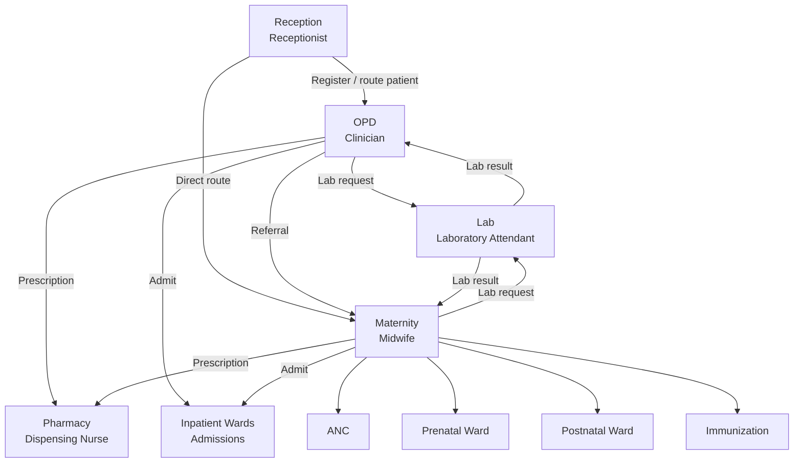
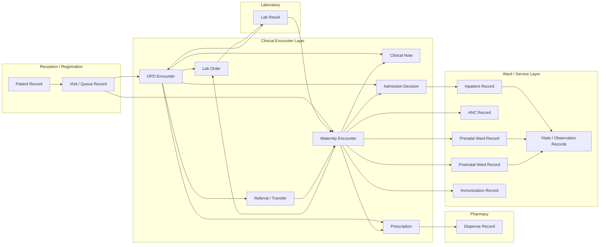

# Susunga HC III Patient Flow

Reference diagrams derived from the hand-drawn Susunga HC III patient flow sketch. These are intended as stable context for future architecture, product, and implementation work.

## Clinical Flow

## Data Flow

## Notes

- This is normalized from the hand-drawn image into system-oriented flow, not a strict BPMN model.
- Admission is treated as a clinical decision originating from OPD or Maternity.
- Vitals/observations are modeled as longitudinal records, especially for inpatient, prenatal, and postnatal care.
- Pharmacy, lab, and maternity are not edge cases; they are first-class operational branches that should be reflected in app workflow and data design.
